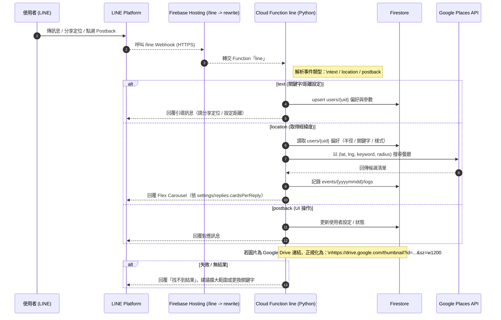

# 🍱 吃飯囉！整個城市都是我的後廚房 (What To Eat Now)<a id="現在吃什麼-what-to-eat-now"></a>

一個結合 **LINE 聊天機器人 + Google Maps Places API + Firebase 後台**
的推薦系統。\
使用者只需輸入食物名稱與分享位置，系統即時回傳附近的餐廳圖卡。\
管理者可於 Firebase Hosting 後台設定卡片樣式、Maps
成本模式、以及行銷推播。

---
## 📑 目錄 (Table of Contents)

- [🍱 現在吃什麼？ (What To Eat Now)](#現在吃什麼-what-to-eat-now)
  - [🚀 系統概觀 (System Overview)](#系統概觀-system-overview)
  - [🧩 技術架構 (Tech-Stack)](#技術架構-tech-stack)
  - [📂 專案結構 (Project-Structure)](#專案結構-project-structure)
  - [⚙️ 安裝與部署 (Setup--Deployment)](#️安裝與部署-setup--deployment)
  - [🔐 Firestore 結構 (Firestore-Schema)](#firestore-結構-firestore-schema)
  - [💬 LINE Bot 功能 (LINE-Webhook)](#line-bot-功能-line-webhook)
  - [🧰 後台功能 (Admin-Console)](#後台功能-admin-console)
  - [🌐 Google Drive 圖片轉換](#google-drive-圖片轉換)
  - [📡 管理員推播 API (`adminPush`)](#管理員推播-api-adminpush)
  - [🔍 附註 (Notes)](#附註-notes)
  - [🧑‍💻 作者 (Author)](#作者-author)

---

## 🚀 系統概觀 (System Overview)<a id="系統概觀-system-overview"></a>

    使用者 (LINE)
       │
       ▼
    LINE Messaging API → Firebase Functions (Python)
       │
       ├── Firestore：使用者偏好、訊息、事件日誌
       ├── Google Places API：搜尋附近餐廳
       └── 回傳 Flex Message 圖卡

    Firebase Hosting (Admin)
       ├── index.html：Google 登入頁
       ├── maps.html：Maps 成本管理
       ├── styles.html：卡片樣式設定
       ├── marketing.html：行銷推播工具
       └── users.html：使用者清單

---

## 🧩 技術架構 (Tech Stack)<a id="技術架構-tech-stack"></a>

  |模組              |技術  |
  |-----------------|----------------------------------------|
  |Cloud Functions   |Python 3.13 + firebase-functions|
  |Database          |Firestore (Native mode)|
  |Frontend          |HTML + JS (ES Module)|
  |Hosting           |Firebase Hosting (public/admin)|
  |Auth              |Firebase Authentication (Google Login)|
  |API               |LINE Messaging API, Google Places API|
  |Storage           |Firebase Storage (theme/fallback.jpg)|

---

## 📂 專案結構 (Project Structure)<a id="專案結構-project-structure"></a>

    functions/
    ├── main.py              # LINE webhook + adminPush API (Python)
    ├── requirements.txt     # Python 依賴
    └── .gitignore

    public/admin/
    ├── index.html           # 後台登入頁（Google 登入 + 白名單檢查）
    ├── admin.js
    ├── maps.html / maps.js  # Maps 成本管理 + usage_maps_daily
    ├── styles.html / styles.js # Flex 卡片主題樣式設定
    ├── marketing.html       # 行銷推播工具（連動 adminPush）
    ├── users.html           # 使用者清單
    └── lib/
        ├── firebase.js      # Firebase 初始化（v11 ESM）
        ├── navbar.js        # 共用導覽列元件
        └── navbar.css       # 導覽列樣式

---

## ⚙️ 安裝與部署 (Setup & Deployment)<a id="安裝與部署-setup--deployment"></a>

### 1️⃣ 初始化 Firebase

``` bash
firebase init functions hosting
# 選擇 Python runtime, 地區 asia-east1
```

### 2️⃣ 安裝 Python 依賴

``` bash
pip install -r functions/requirements.txt
```

### 3️⃣ 設定 Secrets

``` bash
firebase functions:secrets:set LINE_CHANNEL_ACCESS_TOKEN
firebase functions:secrets:set LINE_CHANNEL_SECRET
firebase functions:secrets:set PLACES_API_KEY
firebase functions:secrets:set LIFF_SLOT_URL
```

### 4️⃣ 部署 Functions + Hosting

``` bash
firebase deploy --only functions,hosting
```

---

## 🔐 Firestore 結構 (Firestore Schema)<a id="firestore-結構-firestore-schema"></a>

  |集合 / {文件}   |說明|
  |-------------------------------------| ---------------------------------------------|
  |`users/{uid}`|                          使用者基本資料、偏好、搜尋半徑、對話紀錄
  |`users/{uid}/messages`|                 各次訊息紀錄
  |`events/{yyyymmdd}/logs`|               LINE webhook 事件日誌
  |`settings/theme`|                       Flex 卡片樣式設定（按鈕顏色、比例、預設圖）
  |`settings/maps`|                        Google Maps 成本與模式
  |`settings/replies`|                     每次回傳的餐廳卡數量 (3--9)
  |`admins/{uid}`|                         後台管理員白名單
  |`usage_maps_daily/{yyyymmdd}`|          Google Maps API 每日用量
  |`push_jobs`|                            行銷推播執行記錄

---

## 💬 LINE Bot 功能 (LINE Webhook)<a id="line-bot-功能-line-webhook"></a>



---

## 🧰 後台功能 (Admin Console)<a id="後台功能-admin-console"></a>

  |頁面                               |說明
  |-----------------------------------|------------------------------------
  |**index.html**                     |Google 登入頁，檢查 Firestore`admins/{uid}` 白名單
  |**maps.html**                      |設定Google Maps API：成本模式、每日預算、警示門檻；同步Firestore 與 usage 監控
  |**styles.html**                    |即時預覽與編輯 Flex 卡樣式，支援Storage 上傳 fallback 圖片
  |**marketing.html**                 |行銷推播工具，從 `users`過濾條件選取對象並呼叫 `adminPush`API
  |**users.html**                     |使用者清單檢視，支援displayName、UID、食物偏好即時篩選


---

## 🌐 Google Drive 圖片轉換<a id="google-drive-圖片轉換"></a>

`normalize_image_url()` 會自動將 Google Drive 分享連結轉換為可顯示縮圖：

``` python
https://drive.google.com/file/d/11fAzbE_6ra00yN2xGPZ3F8wl6mAhBq-0/view?usp=sharing
→
https://drive.google.com/thumbnail?id=11fAzbE_6ra00yN2xGPZ3F8wl6mAhBq-0&sz=w1200
```

---

## 📡 管理員推播 API (`adminPush`)<a id="管理員推播-api-adminpush"></a>

### Endpoint

    POST /adminPush
    Authorization: Bearer <Firebase ID Token>

### Request Body

``` json
{
  "targets": ["Uxxxxxxxx1", "Uxxxxxxxx2"],
  "message": {
    "type": "flex",
    "title": "週末優惠",
    "body": "全品項 8 折，只到週日！",
    "image": "https://yourhost/img/promo.jpg",
    "buttonLabel": "查看詳情",
    "buttonUrl": "https://yourliffpage"
  }
}
```

------------------------------------------------------------------------

## 🔍 附註 (Notes)<a id="附註-notes"></a>

-   所有前端程式皆採用 ESM 模組，引用 `firebase v11`。

-   後端與前端共用同一個 Firebase 專案。

-   Hosting domain：

        https://what-to-eat-now-64db0.web.app/admin/

-   所有設定皆以 Firestore 為唯一真實資料來源。

------------------------------------------------------------------------

## 🧑‍💻 作者 (Author)<a id="作者-author"></a>

**陳宗葆 Tsung-Pao Chen**\
Platform Development Engineer / 台南\
GitHub: [@tsungpaochen](https://github.com/tsungpaochen)
