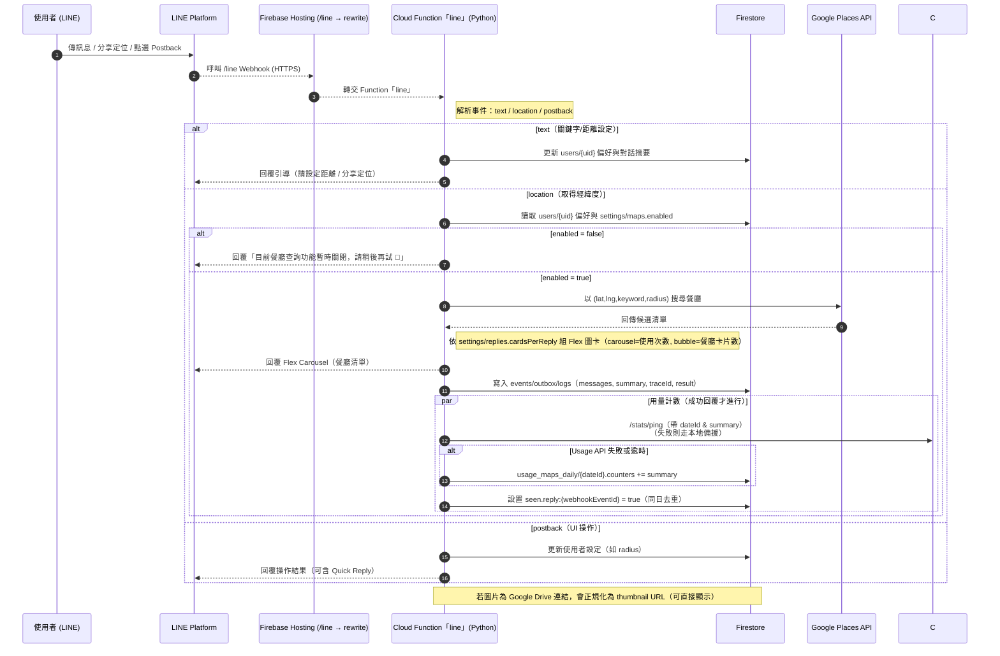
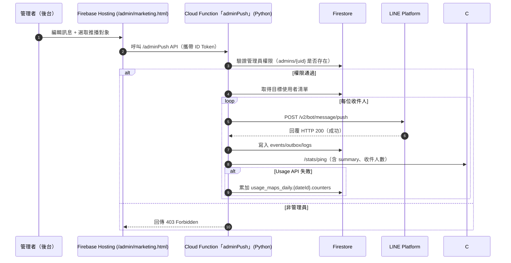

# 🍱 吃飯囉！整個城市都是我的後廚房 (What To Eat Now)<a id="現在吃什麼-what-to-eat-now"></a>

結合 **LINE 聊天機器人 + Google Maps Places API + Firebase（Functions/Firestore/Hosting/Auth/Storage）+ Cloud Run（.NET 8）**
的餐廳推薦系統。<br>
使用者只需輸入喜好食物與分享位置，系統即時回傳附近的餐廳清單（Flex 圖卡）。<br>
管理者可在後台網頁設定圖卡樣式、Google Maps Places API 成本估算、功能開關、行銷推播，並查看「今日 / 本月」用量（含 Places API 估算）。
> Runtime：Functions(Python 3.13), Cloud Run(.NET 8), Firebase JS SDK v11（ESM）

---
## 📑 目錄 (Table of Contents)

- [🍱 現在吃什麼？ (What To Eat Now)](#現在吃什麼-what-to-eat-now)
  - [🚀 系統概觀 (System Overview)](#系統概觀-system-overview)
  - [🧩 技術架構 (Tech-Stack)](#技術架構-tech-stack)
  - [📂 專案結構 (Project-Structure)](#專案結構-project-structure)
  - [⚙️ 安裝與部署](#安裝與部署)
    - [Functions（Python）](#functions-python)
    - [Cloud Run（C# 用量 API）](#cloud-run)
    - [Hosting（含 Rewrite）](#hosting)
  - [🔐 Firestore 結構 (Firestore-Schema)](#firestore-結構-firestore-schema)
  - [💬 LINE Bot 功能 (LINE-Webhook)](#line-bot-功能-line-webhook)
  - [🧰 後台功能 (Admin-Console)](#後台功能-admin-console)
  - [📢 管理推播（adminPush）](#管理推播-adminpush)
  - [📊 用量與計費：怎麼算？](#用量與計費-怎麼算)
  - [🌐 Google Drive 圖片轉換](#google-drive-圖片轉換)
  - [🔒 安全與權限](#安全與權限)
  - [🧯 疑難排解](#疑難排解)
  - [🏷️ 名詞對照](#名詞對照)
  - [🧑‍💻 作者 (Authors)](#作者-author)
---
## 🧱 專案版本
- **Functions:** Python 3.13
- **Cloud Run:** .NET 8 Minimal API
- **Firebase JS SDK:** v11 (ESM)
- **Firestore:** Native Mode
- **最後更新：** 2025-11-02
---

## 🚀 系統概觀 (System Overview)<a id="系統概觀-system-overview"></a>

    使用者 (LINE)
       │
       ▼
    LINE Messaging API → Firebase Functions (Python)
       │
       ├── Firestore：使用者偏好、訊息、事件日誌
       ├── Google Places API：搜尋附近餐廳
       └── 回傳 Flex Message 圖卡

    Firebase Hosting (Admin)
       ├── index.html：Google 登入頁
       ├── maps.html：Maps 成本管理
       ├── styles.html：卡片樣式設定
       ├── marketing.html：行銷推播工具
       └── users.html：使用者清單

---

## 🧩 技術架構 (Tech Stack)<a id="技術架構-tech-stack"></a>

  |模組              |技術  |
  |-----------------|----------------------------------------|
  |Cloud Functions   |Python 3.13 + firebase-functions|
  |Database          |Firestore (Native mode)|
  |Frontend          |HTML + JS (ES Module)|
  |Hosting           |Firebase Hosting (public/admin)|
  |Auth              |Firebase Authentication (Google Login)|
  |API               |LINE Messaging API, Google Places API|
  |Storage           |Firebase Storage (theme/fallback.jpg)|
  | Cloud Run        | .NET 8 Minimal API（用量彙總 /stats/today、/health） |

---

## 📂 專案結構 (Project Structure)<a id="專案結構-project-structure"></a>

    functions/
    ├── main.py              # LINE webhook + adminPush API (Python)
    ├── requirements.txt     # Python 依賴
    └── .gitignore

    public/admin/
    ├── index.html           # 後台登入頁（Google 登入 + 白名單檢查）
    ├── admin.js
    ├── maps.html / maps.js  # Maps 成本管理 + usage_maps_daily
    ├── styles.html / styles.js # Flex 卡片主題樣式設定
    ├── marketing.html       # 行銷推播工具（連動 adminPush）
    ├── users.html           # 使用者清單
    └── lib/
        ├── firebase.js      # Firebase 初始化（v11 ESM）
        ├── navbar.js        # 共用導覽列元件
        └── navbar.css       # 導覽列樣式

---

## ⚙️ 安裝與部署 <a id="安裝與部署"></a>

### Functions（Python）<a id="functions-python"></a>

#### 1. 初始化 

  ``` bash
  firebase init functions hosting
  # 選擇 Python runtime, 地區 asia-east1
  ```

#### 2. Secrets

  ``` bash
  firebase functions:secrets:set LINE_CHANNEL_ACCESS_TOKEN
  firebase functions:secrets:set LINE_CHANNEL_SECRET
  firebase functions:secrets:set PLACES_API_KEY
  firebase functions:secrets:set LIFF_SLOT_URL
  ```

#### 3. 部署

  ``` bash
  pip install -r functions/requirements.txt
  firebase deploy --only functions
  ```

### Cloud Run（C# 用量 API）<a id="cloud-run"></a>


#### 1. 建映像 & 佈署

  ``` bash
  gcloud builds submit --tag gcr.io/<PROJECT_ID>/eatnow-usage-api
  gcloud run deploy eatnow-usage-api \
    --image gcr.io/<PROJECT_ID>/eatnow-usage-api \
    --region asia-east1 \
    --allow-unauthenticated \
    --set-env-vars FIREBASE_PROJECT_ID=<PROJECT_ID>
  ```

#### 2. 健康檢查
  - `GET https://<service-url>/health` 應回 200
  - `GET https://<service-url>/stats/today` 應回今日用量 JSON

### Hosting（含 Rewrite）<a id="hosting"></a>


`firebase.json` 需加入（重點節錄）：

``` json
{
  "hosting": {
    "rewrites": [
      {
        "source": "/api/usage/**",
        "run": { "serviceId": "eatnow-usage-api", "region": "asia-east1" }
      }
    ]
  }
}
```
佈署：

``` bash
firebase deploy --only hosting
```

> 後台 `maps.js` 會先呼叫 `/api/usage/stats/today`，若 404 會自動 fallback 直連 Cloud Run，最後再以 Firestore 今日文件補值（確保 UI 不空白）。<br>
> 提醒：`/api/usage/**` 皆反向代理到 Cloud Run 的用量 API；非用量服務請勿掛在此前綴。

---


## 🔐 Firestore 結構 (Firestore Schema)<a id="firestore-結構-firestore-schema"></a>
> 備註：`theme`/`maps`/`replies` 皆為 `settings` 集合下的文件。

  |集合 / {文件}   |說明|
  |-------------------------------------| ---------------------------------------------|
  |`users/{uid}`|使用者基本資料、偏好、搜尋半徑、對話紀錄
  |`users/{uid}/messages/{}`|每次訊息摘要
  |`events/{yyyymmdd}/logs`|LINE 事件日誌（type: message / postback…）
  |`events/outbox/logs`|實際送出的 reply/push 記錄（含 `messages`、`summary`、`traceId`）
  |`settings/theme`|Flex 樣式（顏色、圓角、fallback 圖…）
  |`settings/maps`|Maps 成本與模式，`enabled` 一鍵開關
  |`settings/replies`|`cardsPerReply`：每次回傳幾張餐廳卡 (3-9)
  |`admins/{uid}`|後台管理員白名單
  |`usage_maps_daily/{yyyymmdd}`|每日用量（counters.* 與 seen.* 去重）

---

## 💬 LINE Bot 功能 (LINE Webhook)<a id="line-bot-功能-line-webhook"></a>

- 使用者傳 位置 → Functions 讀取 `settings/maps.enabled`：
  - `false`：回「目前餐廳查詢功能暫時關閉，請稍後再試 🙏」
  - `true`：呼叫 **Places API** 搜尋 → 回覆 **Flex 圖卡（carousel）**，張數來自 `settings/replies.cardsPerReply`
- 每次回覆成功才會計數，並寫入 `events/outbox/logs`（含 `message`s、`summary`、`result、traceId`）。
- 計數採**同日去重**，`seen.reply:{webhookEventId}` 防重複觸發累加。


```mermaid
sequenceDiagram
    autonumber
    participant U as 使用者 (LINE)
    participant L as LINE Platform
    participant H as Firebase Hosting (/line → rewrite)
    participant F as Cloud Function「line」(Python)
    participant FS as Firestore
    participant GP as Google Places API
    participant CR as C# Usage API (Cloud Run)

    U->>L: 傳訊息 / 分享定位 / 點選 Postback
    L-->>H: 呼叫 /line Webhook (HTTPS)
    H-->>F: 轉交 Function「line」

    Note right of F: 解析事件：text / location / postback

    alt text（關鍵字/距離設定）
      F->>FS: 更新 users/{uid} 偏好與對話摘要
      F-->>L: 回覆引導（請設定距離 / 分享定位）
    else location（取得經緯度）
      F->>FS: 讀取 users/{uid} 偏好與 settings/maps.enabled
      alt enabled = false
        F-->>L: 回覆「目前餐廳查詢功能暫時關閉，請稍後再試 🙏」
      else enabled = true
        F->>GP: 以 (lat,lng,keyword,radius) 搜尋餐廳
        GP-->>F: 回傳候選清單
        Note right of F: 依 settings/replies.cardsPerReply 組 Flex 圖卡（carousel=使用次數, bubble=餐廳卡片數）
        F-->>L: 回覆 Flex Carousel（餐廳清單）
        F->>FS: 寫入 events/outbox/logs（messages, summary, traceId, result）
        par 用量計數（成功回覆才進行）
          F->>CR: /stats/ping（帶 dateId & summary）<br/>（失敗則走本地備援）
          alt Usage API 失敗或逾時
            F->>FS: usage_maps_daily/{dateId}.counters += summary
          end
          F->>FS: 設置 seen.reply:{webhookEventId} = true（同日去重）
        end
      end
    else postback（UI 操作）
      F->>FS: 更新使用者設定（如 radius）
      F-->>L: 回覆操作結果（可含 Quick Reply）
    end

    Note over F,FS: 若圖片為 Google Drive 連結，會正規化為 thumbnail URL（可直接顯示）

```

---

## 🧰 後台功能 (Admin Console)<a id="後台功能-admin-console"></a>

  |頁面                               |說明
  |-----------------------------------|------------------------------------
  |**index.html**                     |Google 登入頁，檢查 Firestore`admins/{uid}` 白名單
  |**maps.html**                      |設定 Google Maps API：成本模式、每日預算、警示門檻，並具備 一鍵關閉功能（將 settings/maps.enabled 設為 `false`，使 LINE Bot 暫停回覆餐廳查詢）。再次打開時，只需勾選**功能開關**後按**儲存變更**。
  |**styles.html**                    |即時預覽與編輯 Flex 卡樣式，支援Storage 上傳 fallback 圖片
  |**marketing.html**                 |行銷推播工具，從 `users`過濾條件選取對象並呼叫 `adminPush`API
  |**users.html**                     |使用者清單檢視，支援displayName、UID、食物偏好即時篩選

---

## 📢 管理推播（adminPush）<a id="管理推播-adminpush"></a>

> 對應後台頁面：[`/admin/marketing.html`](https://what-to-eat-now-64db0.web.app/admin/marketing.html)

管理者可在此頁一次性發送特定行銷訊息，  
支援自訂文字、圖片、Flex 圖卡（可含商品卡、活動卡等）。

---

### 🧩 操作方式

1. 登入後台 → **行銷推播** 頁。
2. 篩選對象：
   - 可依使用者屬性（地區、偏好、上次互動日期）過濾。
   - 預設會讀取 Firestore `users/{uid}` 的欄位。
3. 編輯推播內容：
   - **文字訊息**：支援多行與 emoji。
   - **圖片訊息**：可貼上 Google Drive 連結（系統自動轉為 thumbnail）。
   - **Flex 圖卡**：可選擇「產品卡樣式」或「活動卡樣式」，來源為 `settings/theme`。
4. 點擊「送出推播」：
   - 會呼叫 Functions `adminPush()`。
   - 後端以批次方式發送給符合條件的使用者。

---

### ⚙️ 內部流程 (Mermaid)


```mermaid
sequenceDiagram
    autonumber
    participant A as 管理者（後台）
    participant H as Firebase Hosting (/admin/marketing.html)
    participant F as Cloud Function「adminPush」(Python)
    participant FS as Firestore
    participant L as LINE Platform
    participant CR as C# Usage API (Cloud Run)

    A->>H: 編輯訊息 + 選取推播對象
    H->>F: 呼叫 /adminPush API（攜帶 ID Token）
    F->>FS: 驗證管理員權限（admins/{uid} 是否存在）
    alt 權限通過
        F->>FS: 取得目標使用者清單
        loop 每位收件人
            F->>L: POST /v2/bot/message/push
            L-->>F: 回覆 HTTP 200（成功）
            F->>FS: 寫入 events/outbox/logs
            F->>CR: /stats/ping（含 summary、收件人數）
            alt Usage API 失敗
                F->>FS: 累加 usage_maps_daily.{dateId}.counters
            end
        end
    else 非管理員
        F-->>H: 回傳 403 Forbidden
    end
```
### 📦 Firestore 寫入範例
```bash
events/outbox/logs/{docId}
```
記錄以下欄位：
| 欄位         | 說明                                                 |
| ---------- | -------------------------------------------------- |
| `ts`       | 時間戳記（毫秒）                                           |
| `channel`  | 固定為 `"line"`                                       |
| `kind`     | `"push"`                                           |
| `to`       | 收件人 UID 陣列                                         |
| `messages` | 實際傳送的訊息內容（文字、Flex、圖片等）                             |
| `summary`  | 各類訊息數量摘要（text / image / flexBubble / flexCarousel） |
| `traceId`  | 本次推播唯一識別 ID（防重複）                                   |
| `result`   | `"ok"` 或 `"failed"`                                |

### 💰 計費與統計
| 類別         | 計算方式                                                     |
| ---------- | -------------------------------------------------------- |
| **推播計數**   | 每筆訊息 × 收件人數                                              |
| **卡片類型**   | Flex bubble / carousel 同樣會被計數                            |
| **用量來源**   | 同樣寫入 `usage_maps_daily/{dateId}`（累加）                     |
| **回補 API** | 若需重算，可使用 `backfill_usage` 並指定 `"includeAdminPush": true` |

> 📘 提醒：
>- 若推播失敗（使用者封鎖、過期 token），系統會標記 "result": "failed"，不再累計。
>- 用量 API (/stats/today) 會將管理推播與使用者互動分開列出。

### ⚠️ 注意事項
- **權限**：僅限 `admins/{uid}` 白名單內帳號。
- **推播次數上限**：單日推播次數建議 ≤ 10 次，以免 LINE 官方觸發防濫發限流。
- **內容審查**：若包含 URL、圖片，請確保來源 HTTPS 且可公開存取。
- **收件人測試**：建議先用「預覽模式」僅發送給自己。
- **推播與回覆分流**：
  - 回覆 (reply)：使用者主動互動，不乘收件人數。
  - 推播 (push)：系統主動發送，乘收件人數。

### ✅ 管理者操作範例
- 全體推播
  > 例如週末活動、優惠券、假期通知。
- 特定條件推播
  > 僅發送給「上次互動超過 7 天未使用」或「偏好關鍵字 = 火鍋」的使用者。
- 定期公告
  > 每月初自動發送「本月推薦餐廳」，可與排程 Cloud Scheduler 整合。

---

## 📊 用量與計費：怎麼算？<a id="用量與計費-怎麼算"></a>
### 即時計數（reply / push）
- reply（使用者互動）<br>
回覆成功才計數；`summary` 解析 文字/圖片/Flex（使用次數/餐廳卡片）。
  - 使用次數 = 一次完整餐廳推薦（回一個 carousel）
  - 餐廳卡片 = carousel 內泡泡數（3–9）
- push（管理員推播）<br>
以收件人數乘上 `summary` 計數；同樣寫入 `events/outbox/logs`，支援去重（`traceId`）。
- 去重<br>
`usage_maps_daily/{dateId}/seen/reply:{webhookEventId} = true`

### Places API 估算（今日 / 本月）
> 後台 `maps` 直接顯示「今日」與「本月」Places API 估算。
- 估算公式（每次回覆）：
  - **使用次數** × 1（地點查詢）
  - **餐廳卡片** × 2（圖片 + 位置連結）
- 今日：來自 C# `/stats/today`；若 API 失效，改用 Firestore 今日文件補值
- 本月：逐日加總 `usage_maps_daily/*` 以相同公式計算

> 註：`messages_total` 為當日實際送出的 LINE 訊息總數（文字/圖片/Flex 等合計），**不是** Places API 次數。

> 📎 **官方費率說明**
>
> - **Google Maps Places API 價格表**  
>   https://developers.google.com/maps/billing/gmp-billing?hl=zh-tw  
>   - 「Places API」屬於 *Places Details*、*Nearby Search*、*Text Search* 類別  
>   - 每次查詢會計一次請求；若同時載入圖片（Place Photo）則額外計費  
>   - 費用以「每 1000 次請求」計算，依地區與帳號計價方案略有不同  
>
> - **LINE Messaging API 使用量與費率**  
>   https://developers.line.biz/en/pricing/messaging-api/  
>   - 官方帳號每月有免費額度（取決於方案）  
>   - 超出部分以訊息數量（含文字、Flex、圖片）計費  
>   - 「推播（push）」與「回覆（reply）」皆會計入訊息數

### 回補歷史（Backfill API）
> 需要「管理員 ID Token」，只回填 reply；可選擇是否含管理推播。
- Endpoint<br>
`POST https://asia-east1-<PROJECT_ID>.cloudfunctions.net/backfill_usage`<br>
`Authorization: Bearer <Firebase ID Token>`
- Body<br>
  ``` json
  {
    "from": "20251025",        // 起日(含)
    "to":   "20251028",        // 迄日(不含)
    "cards": 6,                // 若無 outbox，改用 events/location × cards 估算
    "source": "auto",          // auto | outbox | events
    "includeAdminPush": true   // 是否把管理推播也算入
  }
  ```
- 回傳<br>
  ``` json
  { "ok": true, "updatedDays": 3, "summary": { "20251025": {...}, ... } }
  ```
- 快速執行（PowerShell）
  ``` powershell
  $URL   = "https://asia-east1-<PROJECT_ID>.cloudfunctions.net/backfill_usage"
  $TOKEN = "<你的 Firebase ID Token>"
  $BODY  = @{ from="20251025"; to="20251028"; source="auto"; cards=6; includeAdminPush=$true } | ConvertTo-Json
  Invoke-RestMethod -Method POST -Uri $URL -Headers @{ Authorization="Bearer $TOKEN" } -ContentType "application/json" -Body $BODY
  ```
| 指標 | 來源 | 意義 |
|------|------|------|
| 使用次數 | messages_flex_carousel | 功能被使用的次數 |
| 餐廳卡片 | messages_flex_bubble | 回傳的餐廳總數 |
| Places API 請求 | 使用次數×1 + 卡片×2 | 預估 Google 費用 |

---

## 🌐 Google Drive 圖片轉換<a id="google-drive-圖片轉換"></a>

`normalize_image_url()` 會自動將 Google Drive 分享連結轉換為可顯示縮圖：

``` python
https://drive.google.com/file/d/11fAzbE_6ra00yN2xGPZ3F8wl6mAhBq-0/view?usp=sharing
→
https://drive.google.com/thumbnail?id=11fAzbE_6ra00yN2xGPZ3F8wl6mAhBq-0&sz=w1200
```

---

## 🔒 安全與權限<a id="安全與權限"></a>
- 後台登入：Firebase Auth（Google） + Firestore `admins/{uid}` 白名單
- 回補與推播 API：必須帶 Firebase ID Token 且為管理員
- LINE 金鑰、Places API Key：存於 Functions Secrets
- 一鍵關閉：寫入 `settings/maps.enabled=false`，LINE 端即刻停用餐廳查詢

---

## 🧯 疑難排解 <a id="疑難排解"></a>

- `/api/usage/stats/today 404`
  1) 檢查Cloud Run 是否有 /stats/today 這條路由？（試打 Service URL）
      ```bash
      curl https://eatnow-usage-api-xxxx.asia-east1.run.app/stats/today
      ```
  2) `firebase.json` 的 rewrites serviceId/region 是否正確？
  3) 佈署 Hosting `firebase deploy --only hosting` 是否已完成？
  4) 後台有 **fallback**：會改直連 Cloud Run；仍失敗則用 Firestore 今日文件補值。
- 計數與畫面不一致
  - 先看 `events/outbox/logs` 是否有寫入
  - 查看 `usage_maps_daily/{today}/seen` 是否已去重
  - `messages_total` 大於預期，多半是流程中額外回了提示文字（屬實際送出）
- 關閉功能不生效
  - 確認 `settings/maps.enabled` 是否為 `false`（後台儲存成功）
  - LINE webhook 邏輯會直接判斷 `enabled`，**不需重新佈署**

---
## 🏷️ 名詞對照（給管理者看得懂）<a id="名詞對照"></a>
| 顯示文字        | 內部欄位                     | 意義                       |
| ----------- | ------------------------ | ------------------------ |
| **使用次數**    | `messages_flex_carousel` | 一次完整餐廳推薦（回 1 個 carousel） |
| **餐廳卡片**    | `messages_flex_bubble`   | carousel 內卡片張數（3–9）      |
| **附帶文字**    | `messages_text`          | 回覆中的文字訊息數                |
| **推播可計費總數** | `push_total`             | 管理推播訊息，乘上收件人數後的總數        |

---

## 🧑‍💻 作者 (Authors)<a id="作者-author"></a>

**陳宗葆 Tsung-Pao Chen**\
Platform Development Engineer / 台南<br>
GitHub: [@blueskycm](https://github.com/blueskycm)

**蘇菲Sophia**<br>
GitHub: [@sophialaoshi](https://github.com/sophialaoshi)

**曜**<br>
GitHub: [@barry0913962988-blip](https://github.com/barry0913962988-blip)

**ShiYo**<br>
GitHub: [@Yakitori197](https://github.com/Yakitori197)